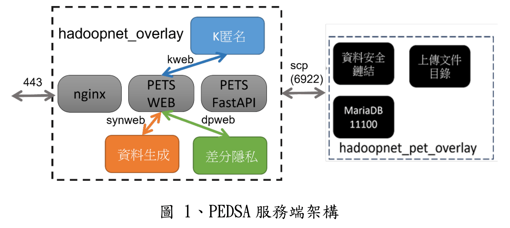
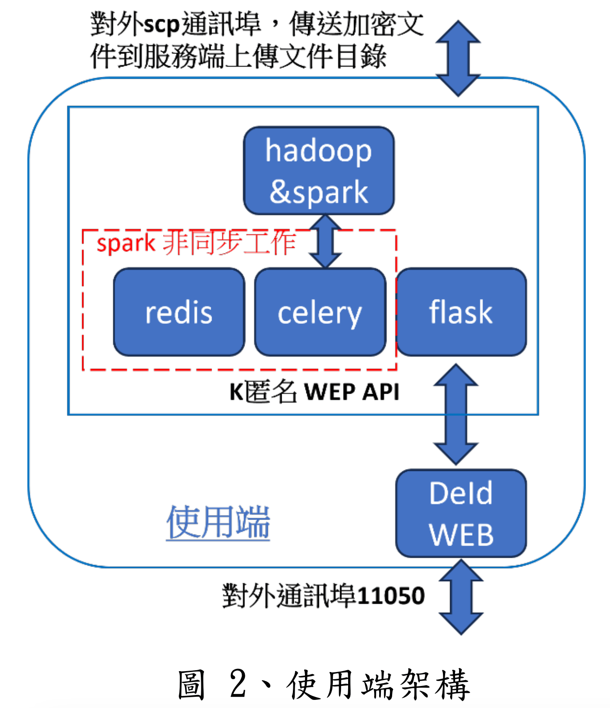

# 目的

本文期望能夠幫助使用者、資訊人員或是廠商在觀看本手冊後，能夠了解並且能自行安裝 PEDSA 系統。

PEDSA主要提供 K匿名、資料生成及差分隱私三種服務。此外，為了方便多個導入機關共同處理資料，也提供資料安全鏈結系統，讓不同機關的使用者安全的上傳檔案及鏈結資料。PEDSA 區分為服務端與使用端，服務端包含 K 匿名、資料生成、差分隱私以及安全鏈結，使用端則提供加密機敏欄位、安全上傳檔案兩個功能。

無論服務端與使用端，都建置於 docker 微服務架構上。為了在Linux Ubuntu 平台上提供了一個快速且有效的部署方案，並考量部分導入機關需在隔離的環境中進行軟體安裝，故提供shell script 和 tar 檔案，允許在沒有網際網路連接的情況下，經由 tar 檔案取得安裝所需的所有檔案，並透過 shell script 方式安裝系統，確保在網際網路連線受限的環境中能夠順利地安裝 docker 執行環境、安裝必須的 docker 映像檔(image)及部署PEDSA 系統應用軟體。

部署好的服務端如圖 1，包括安全鏈結、K 匿名、差分隱私及資料生成等服務，圖 1 的 hadoopnet_overlay 及hadoopnet_pet_overlay 都是 docker 網路。由於安全資料鏈結服務會與外部的使用端連線，為了安全考量，安全資料鏈結服務單獨放在 hadoopnet_pet_overlay 與其他服務隔離。

圖 2 則為使用端，使用端功能有二，首先是針對使用者選擇的欄位，對 csv 文件的個別欄位進行 AES 加密或 HMAC 雑湊運算，接著就以 scp 協定上傳運算後的 csv 文件。服務端接收到 csv 文件後，安全資料鏈結服務會鏈結所有文件，再將處理好的資料傳給其他服務進行處理。

# 部署流程圖範圍

由上述可知，本手冊的重點在於讓使用者順利了解如何安裝部署，同時也能快速部署上手。由於 PEDSA 使用獨立的 docker 容器來運行服務，部署前需安裝 docker、docker 映像檔及系統應用程式，最後才是啟動 PEDSA 的服務端及使用端。安裝及啟動流程概述如下:

- 安裝 docker:安裝 docker 運行環境，建立 PEDSA 需要的
  docker 網路
- 安裝 docker 映像檔:載入 PEDSA 需要的映像檔
- 安裝 PEDSA 系統應用程式:解壓縮 PEDSA 應用程式到使用者
  指定位置
  以上流程會透過 shell script 的提示，引導使用者安裝PEDSA 系統。
