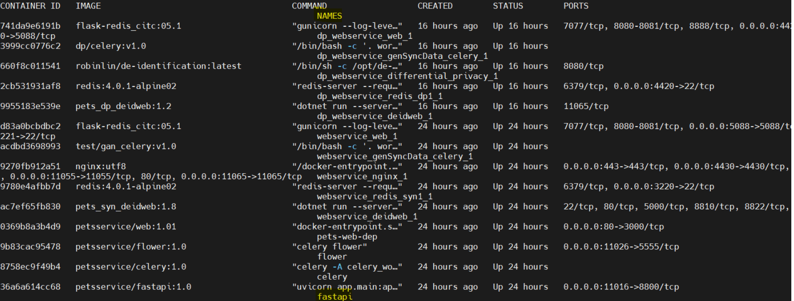

# 當系統安裝好，如何確認系統是否正常啟動?

通常可以執行 `docker ps -a```，觀察是否有出現錯誤訊息時出現的錯誤，多為 docker 設定出錯，例如容器目錄與外部主機原有的對應關係無法滿足，或是 docker 映像檔版本不合等。

當 docker 容器都正常啟動，但 PEDSA 行 `docker logs fastapi`，fastapi 是容器名稱，此容器負責前後端的控制流程，可以觀察到哪一個服務出錯，其他的容器名稱可以由 `docker ps -a` 指令查詢，容器名稱出現在最後一個欄位，如下圖的 NAMES 欄位。


圖12: PEDSA容器名稱

# 以瀏覽器開啟 PEDSA 網頁沒有反映需如何處理?

遇到此情況，執行

```sh
docker service logs pets_syn_nginx
```

觀察是否出錯，nginx 的功能是代轉容器流量，因此有任
何一個容器出錯，均會讓 nginx 無法啟動。除此，也可以
向機房管理員查詢防火牆是否開放表 5 所列的通訊埠。

# 當 fastapi 無法連上 MariaDB，要如何處理?

執行`docker ps -a`查詢 MariaDB的容器名稱，再執行`docker logs $MariaDB_container_name`
觀察資料庫是否正常運作，正常會出現" mysqld: ready for connections. "訊息。

若有出錯，可執行`ls -al ~/PETS/pets_hadoop/pets_v1/sourceCode/hadoop/MariaDBdata/` ,觀察的擁有者是否為 999:999，若否，則執行`sudo chown -R 999:999
~/PETS/pets_hadoop/pets_v1/sourceCode/hadoop/MariaDBdata/`
